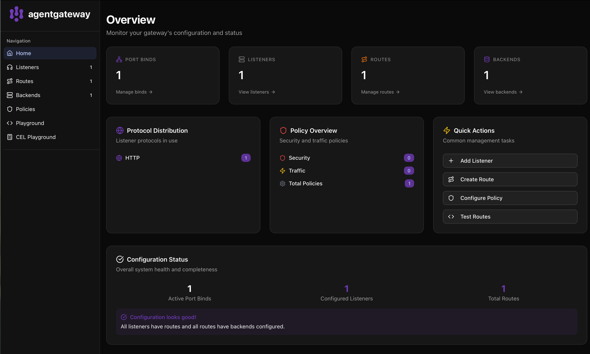
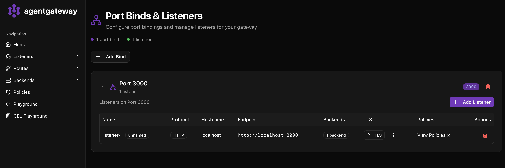
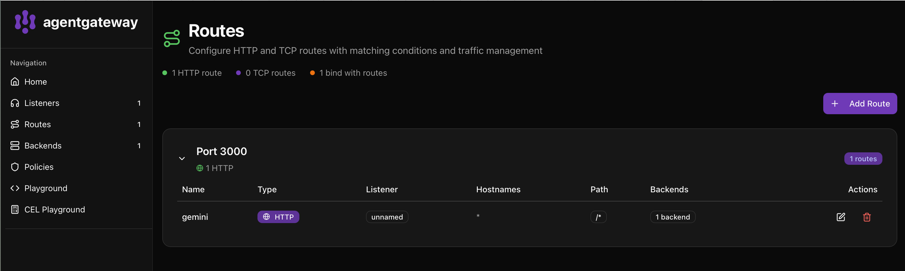
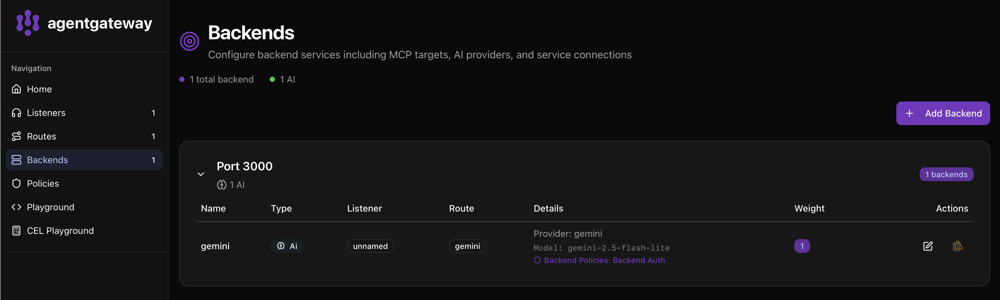
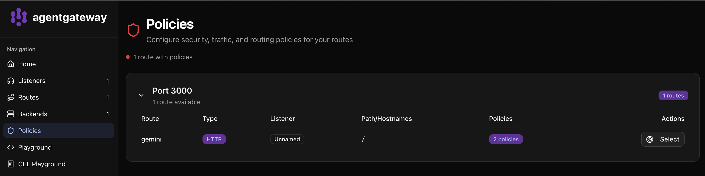

# AI Reliability Engineering — Lab #1

AgentGateway proxy for Google Gemini API. Routes OpenAI-compatible chat completion requests to the Gemini backend via header-based routing.

## Prerequisites

- Docker
- Google Gemini API key (get one at https://aistudio.google.com/)

## Setup

Create a `.env` file in the project root:

```
GEMINI_API_KEY=<your-google-gemini-api-key>
```

## Build

```bash
./build.sh
```

This builds a Docker image named `agentgateway` based on Ubuntu with the [AgentGateway](https://agentgateway.dev/) binary installed.

## Run

```bash
./run.sh
```

Starts the container with:
- **Port 3000** — API endpoint (OpenAI-compatible `/v1/chat/completions`)
- **Port 15000** — Admin interface (localhost only)

The container mounts the current directory so `config.yaml` changes are picked up on restart.

## Test

With the container running:

```bash
./test.sh
```

This sends a sample chat completion request to the Gemini backend:

```bash
curl http://localhost:3000/v1/chat/completions \
  -H "Content-Type: application/json" \
  -H "x-provider: gemini" \
  -d '{"model": "gemini-2.5-flash-lite", "messages": [{"role": "user", "content": "What is the question for answer 42?"}]}'
```

## Admin Interface Screenshots

The admin UI is available at `http://localhost:15000` when the container is running.

### Overview



### Listeners



### Routes



### Backends



### Policies



## Configuration

`config.yaml` defines the AgentGateway routing:
- Listens on port 3000
- Routes requests with `x-provider: gemini` header to the Gemini 2.5 Flash Lite model
- CORS is open (all origins/headers allowed)
- Authenticates with Gemini using `$GEMINI_API_KEY` from the environment

## Project Structure

```
Dockerfile    — Container image definition
config.yaml   — AgentGateway routing configuration
build.sh      — Docker build script
run.sh        — Docker run script
test.sh       — Curl-based smoke test
.env          — Environment variables (not committed)
```
